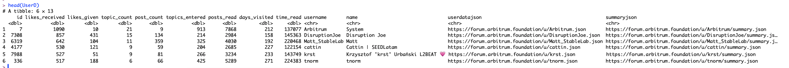
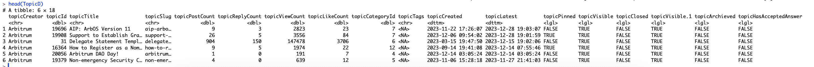
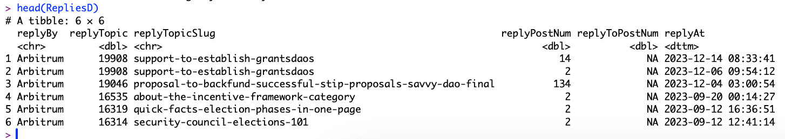
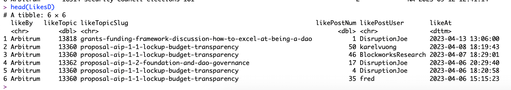

# ArbForumScrape
Automated data pipeline to scrape all the Arbitrum Forum Data in nicely formatted Datasets

### Description

Our `ArbForumScrape` repo contains 2 R scripts which automatically pulls and parse the data in a nice structured CSV files for further analysis.

### Walkthrough

#### 1. Scrape all the governance forum data.

- `Rscript scrape.R`

#### 2. Parse all the data in nicely formatted CSV files.

- `Rscript parse.R`

User Statistics DataFrame in data/UsersDF.csv

&nbsp;
&nbsp;

Topics Statistics DataFrame in data/TopicsDF.csv

&nbsp;
&nbsp;

Replies/Comments Details DataFrame in data/RepliesDF.csv

&nbsp;
&nbsp;

Likes on Comments/Replies Details DataFrame in data/LikesDF.csv

